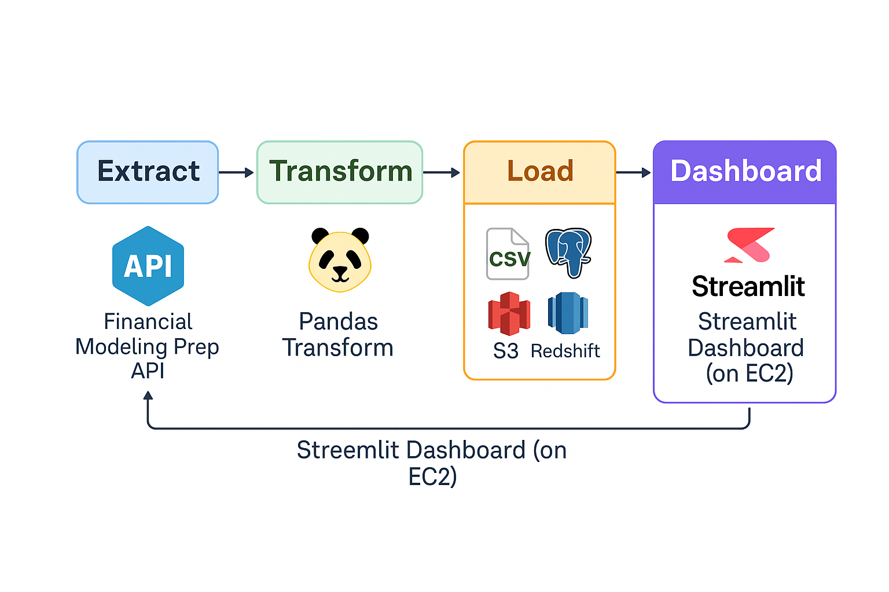
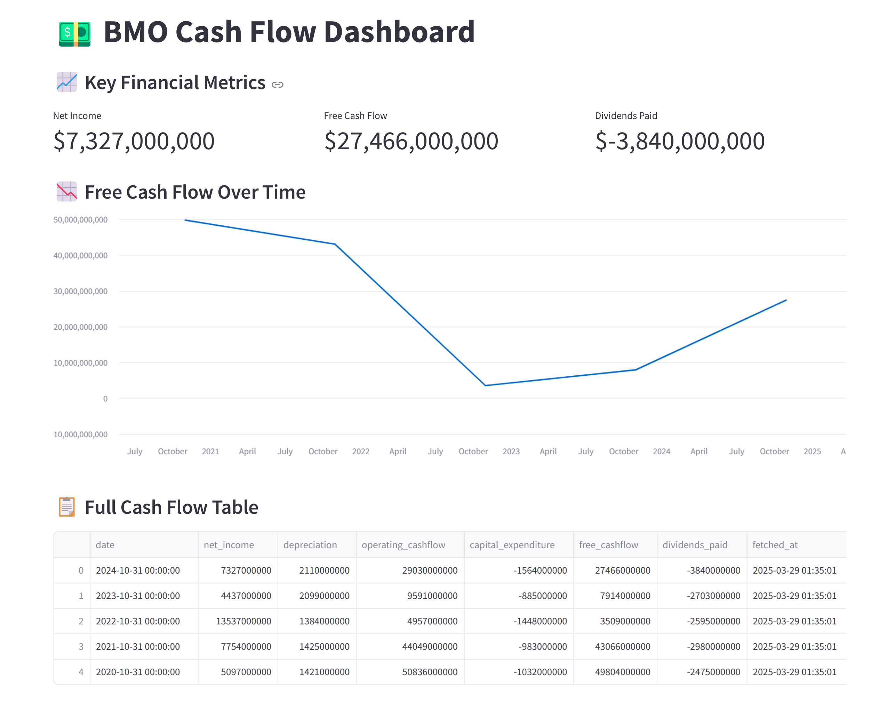

# 💵 BMO Real-Time ETL Pipeline & Dashboard (AWS + Python)


A full ETL project that extracts real-time cash flow data for **Bank of Montreal (BMO)** using public APIs, transforms it with Python, stores it in AWS Redshift, and visualizes it with a live dashboard built in Streamlit and hosted on AWS EC2.

---


## 📌 Project Overview

- 🔄 **Extract**: BMO cash flow data from Financial Modeling Prep API
- 🧹 **Transform**: Clean & format using Pandas
- 💾 **Load**: Into PostgreSQL → AWS S3 → Redshift
- 📊 **Dashboard**: Streamlit app hosted on EC2

---

## 🧱 Architecture

[Financial Modeling Prep API]
           ↓
    🐍 Python Extract Script
           ↓
      📄 Raw CSV File
           ↓
  🔍 Transform with Pandas
           ↓
      📄 Cleaned CSV File
           ↓
 PostgreSQL (local staging DB)
           ↓
          ⬇
 Upload raw & cleaned files → 🪣 AWS S3
           ↓
      COPY to Redshift Serverless
           ↓
 🔎 Streamlit Dashboard (on EC2)



---


## ⚙️ Tech Stack

- **Python 3.12**
- **Pandas**, **psycopg2**, **boto3**
- **PostgreSQL** (local staging DB)
- **AWS S3** (cloud file storage)
- **Amazon Redshift Serverless** (data warehouse)
- **Streamlit** (dashboard UI)
- **AWS EC2** (dashboard hosting)
- **Git & GitHub** (version control)
---

## 🚀 How to Run This Project

```bash
git clone https://github.com/yaminichenna/bmo_real_time_etl.git
cd bmo_real_time_etl
python3 -m venv venv
source venv/bin/activate
pip install -r requirements.txt
```


## 🔄 Run the ETL Pipeline

Follow these steps to extract, clean, load, and store BMO cash flow data:
```bash
# Step 1: Extract raw BMO cash flow data from API
python extract/fetch_bmo_cashflow.py

# Step 2: Transform the data using pandas
python transform/transform_cashflow.py

# Step 3: Load into local PostgreSQL staging database
python load/load_to_postgres.py

# Step 4: Upload both raw and cleaned files to S3
python cloud/upload_to_s3.py

```


## 📷 Dashboard Preview



## 📁 Folder Structure
```bash
bmo_real_time_etl/
├── extract/              # Fetches API data
├── transform/            # Cleans/transforms data
├── load/                 # Loads into PostgreSQL
├── cloud/                # Uploads to S3
├── dashboard/            # Streamlit dashboard
├── architecture.png      # Visual representation of the flow
├── README.md
└── requirements.txt
```


## 🧠 What You'll Learn

- **Building end-to-end ETL with real-time data**

- **Extracting public financial data via REST APIs**

- **Loading to PostgreSQL, S3, and Redshift**

- **Using IAM roles and secure data access**

- **Creating dashboards with Streamlit**

- **Hosting apps on AWS EC2**

## 🔮 Future Enhancements

- **⏰ Add Airflow for automation & orchestration**

- **🐳 Add Docker support**

- **📡 Add monitoring/logging with CloudWatch**

- **📈 Add more KPIs & anomaly detection**

- **📤 Email reports or auto-alerts**

## 👨‍💻 Author
**Yamini Chenna**  
🔗 [GitHub Profile](https://github.com/yaminichenna/bmo_real_time_etl)


